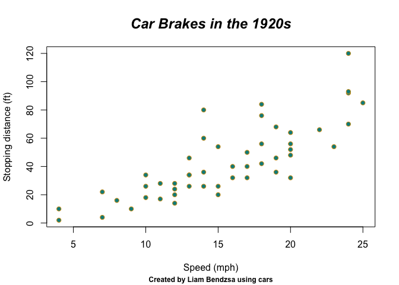

Bendzsa-GEOG712-Repository
================
Liam Bendzsa
2026-09-30

# **Purpose of this repository**

This repository is for the activity portions of the graduate course
GEOG712 offered at McMaster University in Hamilton, ON, Canada. This is
*my* (Liam Bendzsa’s) version, where all future assignment submissions
will be posted to be reviewed by
**[paezha](https://github.com/paezha)**, the Professor of the course.
With that out of the way, here are a few things about the individual,
Liam Bendzsa.

# Liam’s Research Interest

------------------------------------------------------------------------

My primary research interest involves the use of **[modal
shifts](https://en.wikipedia.org/wiki/Sustainable_transport)** to reduce
carbon emissions, and promote other ancillary, if not primary, benefits.
For example, *exercise*, *socialization*, and *exposure to nature* are
all things that are not found in the dominant North American mode of
transport, the car, but are found in modes of **[active
transportation](https://www.canada.ca/en/public-health/services/being-active/active-transportation.html)**

------------------------------------------------------------------------

# Favourites (*Canadian spelling, not sorry*)

## Favourite Music

------------------------------------------------------------------------

1.  **Flyers** by *BRADIO*
2.  **Artificial Nocturne** by *Metric*
3.  **Remembering (feat. Tate McRae)** by *Yutaka Yamada*
4.  **Service and Sacrifice** by *[Jeremy
    Zuckerman](https://soundcloud.com/jeremy-zuckerman)*
5.  **I Meant It** by *Brandon Boone*

------------------------------------------------------------------------

## Favourite Equation

------------------------------------------------------------------------

$$
N(t) = N_o*e^{-\lambda t}
$$

------------------------------------------------------------------------

## Favourite Artists

------------------------------------------------------------------------

| Artist               | Achievement                             |
|----------------------|-----------------------------------------|
| Ludwig van Beethoven | The greatest composer of all time.      |
| Vincent van Goph     | Creator of *Stary Night*.               |
| Wes Anderson         | Director of *The Grand Budapest Hotel*. |
| Sia                  | Vocalist/writer of *This is Acting*.    |
| Ursula K. LeGuin     | Master of Fiction.                      |

------------------------------------------------------------------------

# A Chunk of Code

------------------------------------------------------------------------

*I fixed this graph to make sense*

``` r
plot(cars, col = "goldenrod3", pch= 21, bg= "cyan4", 
     xlab = "Speed (mph)", ylab = "Stopping distance (ft)")
  title(main = "Car Brakes in the 1920s", 
        sub = "Created by Liam Bendzsa using cars", 
        font.sub = "2", cex.sub = "0.75", 
        font.main = "4", cex.main = "1.5")
```

<!-- -->
